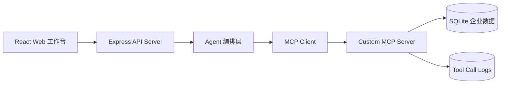

# Enterprise MCP Agent

一个基于 TypeScript 的企业工具调用 Agent。项目展示 API Server 如何通过 MCP Client 调用自定义 MCP Server，并把客户查询、订单查询、报价单生成、待办创建、知识库检索等业务工具编排成可观测的执行流程。

## 技术栈

- TypeScript + Node.js
- MCP TypeScript SDK
- Express API Server
- React + Vite
- SQLite (`node:sqlite`)
- Zod 参数校验
- Vitest 单元测试

## 交付材料

- [完成度核对](docs/delivery/01-completion-checklist.md)
- [架构说明](docs/delivery/02-architecture.md)
- [演示脚本](docs/delivery/03-demo-script.md)
- [功能截图清单](docs/delivery/04-screenshot-list.md)
- [技术亮点说明](docs/delivery/05-technical-highlights.md)
- [部署说明](docs/delivery/06-deployment-guide.md)

## 架构



## 功能

- 自定义 MCP Server
- `search_customer`：按姓名或公司查询客户
- `search_orders`：查询客户订单
- `generate_quote`：生成报价单草稿
- `create_todo`：创建跟进待办
- `search_knowledge_base`：检索内部知识库
- Agent 自动选择工具并串联多步调用
- 工具调用日志
- 角色权限校验
- Zod 参数校验
- 错误处理
- 前端展示 Agent 计划、工具入参、工具出参、耗时和状态
- 可切换编排模式：规则编排与 LLM Tool Calling
- 前端展示工具选择 decision 摘要

## 本地运行

安装依赖：

```bash
npm install
```

初始化 SQLite 数据：

```bash
npm run seed
```

启动完整演示环境：

```bash
npm run dev
```

访问：

```text
http://localhost:5173
```

API 健康检查：

```text
http://localhost:4000/health
```

## 生产构建与启动

构建所有工作区：

```bash
npm run build
```

初始化演示数据：

```bash
npm run seed:prod
```

启动生产服务：

```bash
npm run start
```

生产模式下由 Express API Server 托管前端静态文件，访问：

```text
http://localhost:4000
```

生产启动时 API Server 会通过 MCP Client 拉起构建后的 MCP Server：

```text
apps/mcp-server/dist/apps/mcp-server/src/index.js
```

核心环境变量：

```bash
PORT=4000
NODE_ENV=production
PROJECT_ROOT=/absolute/path/to/enterprise-mcp-agent
WEB_DIST_DIR=/absolute/path/to/enterprise-mcp-agent/apps/web/dist
MCP_SERVER_ENTRY=apps/mcp-server/dist/apps/mcp-server/src/index.js
ENTERPRISE_AGENT_DB=/absolute/path/to/enterprise-mcp-agent/data/enterprise-agent.db
OPENAI_MODEL=gpt-4.1-mini
OPENAI_API_KEY=your_api_key
```

可以从 `.env.example` 复制这些变量。

## Docker 运行

构建镜像：

```bash
docker build -t enterprise-mcp-agent .
```

启动容器：

```bash
docker run --rm -p 4000:4000 enterprise-mcp-agent
```

验证容器：

```bash
curl http://localhost:4000/health
curl http://localhost:4000
```

如果要启用 LLM Tool Calling：

```bash
docker run --rm -p 4000:4000 -e OPENAI_API_KEY=your_api_key enterprise-mcp-agent
```

容器启动时会执行 `npm run seed:prod` 写入演示数据，然后启动 API Server。SQLite 文件位于容器内 `/app/data/enterprise-agent.db`；需要持久化时可挂载 `/app/data`。

项目包含 `.dockerignore`，构建上下文会排除本地 `node_modules`、构建产物和 SQLite 数据文件。

## 编排模式

API Server 支持两种 Agent 编排模式：

| 模式 | 说明 | 适用场景 |
|---|---|---|
| `rule` | 使用可解释的关键词规则选择 MCP 工具 | 离线演示、稳定回归测试、无模型密钥环境 |
| `llm` | 使用 OpenAI Responses API 的 function tools 让模型选择工具 | 复杂自然语言请求、多步工具调用探索 |

前端可以在“规则编排”和“LLM Tool Calling”之间切换。请求体中的 `mode` 字段控制编排策略：

```json
{
  "mode": "llm",
  "message": "查询李明最近订单，根据订单生成报价单，创建明天上午跟进待办，并检索报价规则",
  "user": {
    "id": "u_sales_001",
    "name": "销售一号",
    "role": "sales"
  }
}
```

LLM 模式需要在 API Server 环境配置：

```bash
OPENAI_API_KEY=your_api_key
OPENAI_MODEL=gpt-4.1-mini
```

如果选择 `llm` 但没有配置 `OPENAI_API_KEY`，系统会自动回退到 `rule`，并在前端“决策摘要”中显示回退原因。

无论使用哪种编排模式，业务数据访问都必须经过 MCP Server。API Server 会覆盖模型传入的 `userId` 和 `role`，确保权限上下文来自当前登录用户，而不是模型生成内容。

## 演示请求

```text
查询张三最近订单，生成报价单并创建明天跟进待办
```

预期流程：

1. Agent 选择 `search_customer` 定位客户
2. Agent 选择 `search_orders` 查询订单
3. Agent 选择 `generate_quote` 生成报价单草稿
4. Agent 选择 `create_todo` 创建跟进待办
5. 前端展示每个工具的入参、出参、状态和耗时

权限验证：

```text
查询王芳最近订单
```

- 销售权限：王芳不属于当前销售，工具层会拒绝访问
- 经理权限：可以访问全部客户

参数校验验证：

```bash
curl -X POST http://localhost:4000/api/chat \
  -H "Content-Type: application/json" \
  -d "{\"message\":\"\"}"
```

预期返回 `INVALID_REQUEST`。

## MCP 工具协议说明

### `search_customer`

用途：按客户姓名或公司名称检索 CRM 客户。

输入：

```json
{
  "keyword": "张三",
  "userId": "u_sales_001",
  "role": "sales"
}
```

输出：

```json
{
  "customers": [
    {
      "id": "cus_001",
      "name": "张三",
      "company": "星河科技",
      "level": "VIP",
      "ownerId": "u_sales_001"
    }
  ]
}
```

权限规则：`sales` 只能访问 `ownerId` 等于自己的客户；`manager` 可以访问全部客户。客户存在但无权访问时返回 `PERMISSION_DENIED`。

### `search_orders`

用途：查询指定客户的订单历史。

输入：

```json
{
  "customerId": "cus_001",
  "userId": "u_sales_001",
  "role": "sales"
}
```

输出：

```json
{
  "orders": [
    {
      "id": "ord_002",
      "customerId": "cus_001",
      "product": "MCP 工具接入服务",
      "amount": 42000,
      "status": "processing",
      "createdAt": "2026-07-02T09:15:00.000Z"
    }
  ]
}
```

错误码：`CUSTOMER_NOT_FOUND`、`PERMISSION_DENIED`。

### `generate_quote`

用途：根据客户和产品明细生成报价单草稿。

输入：

```json
{
  "customerId": "cus_001",
  "orderId": "ord_002",
  "items": [
    {
      "name": "MCP 工具接入服务",
      "quantity": 1,
      "unitPrice": 42000
    }
  ],
  "userId": "u_sales_001",
  "role": "sales"
}
```

输出：

```json
{
  "quote": {
    "id": "quote_xxxxxxxx",
    "customerId": "cus_001",
    "orderId": "ord_002",
    "totalAmount": 42000,
    "status": "draft"
  }
}
```

错误码：`CUSTOMER_NOT_FOUND`、`PERMISSION_DENIED`、Zod 参数校验错误。

### `create_todo`

用途：为客户创建跟进待办。

输入：

```json
{
  "customerId": "cus_001",
  "title": "跟进 张三 的业务请求",
  "dueAt": "2026-07-13T02:00:00.000Z",
  "userId": "u_sales_001",
  "role": "sales"
}
```

输出：

```json
{
  "todo": {
    "id": "todo_xxxxxxxx",
    "customerId": "cus_001",
    "title": "跟进 张三 的业务请求",
    "status": "open"
  }
}
```

错误码：`CUSTOMER_NOT_FOUND`、`PERMISSION_DENIED`、Zod 参数校验错误。

### `search_knowledge_base`

用途：检索企业内部规则、状态说明和业务知识。

输入：

```json
{
  "query": "报价规则",
  "userId": "u_sales_001",
  "role": "sales"
}
```

输出：

```json
{
  "articles": [
    {
      "id": "kb_001",
      "title": "报价单生成规则",
      "body": "报价单必须包含客户名称、产品明细、数量、单价、总金额、生成时间和负责人。",
      "tags": "quote,pricing,sales"
    }
  ]
}
```

权限规则：当前版本允许所有已识别角色检索知识库；后续可按标签或部门扩展访问控制。

### 工具调用日志

所有工具都会写入 `tool_call_logs`，字段包括：

- `tool_name`
- `input_json`
- `output_json`
- `status`
- `error_message`
- `duration_ms`
- `user_id`
- `created_at`

前端通过 `/api/logs` 读取最近调用记录，用于观察工具链路、失败原因和执行耗时。

## 决策摘要

`/api/chat` 返回 `decisions` 字段，用来展示 Agent 选择工具的可观测信息：

```json
{
  "step": 1,
  "source": "llm",
  "tool": "search_customer",
  "summary": "模型选择 search_customer，API 层注入当前用户权限后再通过 MCP Server 执行。",
  "arguments": {
    "keyword": "李明",
    "userId": "u_sales_001",
    "role": "sales"
  }
}
```

这个字段只展示可审计的工具选择摘要，不展示模型隐藏推理过程。

## 数据模型

当前 SQLite 包含：

- `customers`：客户数据
- `orders`：订单数据
- `quotes`：报价单草稿
- `todos`：跟进待办
- `knowledge_articles`：知识库文章
- `tool_call_logs`：工具调用日志

## 工程说明

API Server 不直接访问业务数据，而是通过 MCP Client 调用 MCP Server 暴露的工具。工具层负责参数校验、权限校验、业务错误处理和调用日志写入。这个边界让业务工具可以被不同 Agent、脚本或 MCP Host 复用。

当前 Agent 使用可解释的规则编排，便于观察工具选择过程。后续可以把 `apps/api-server/src/agent.ts` 替换为模型驱动的 Tool Calling 策略，但保留 MCP 工具层、权限校验和日志能力。

## 常用命令

```bash
npm run seed
npm run dev
npm run test
npm run typecheck
npm run build
```
