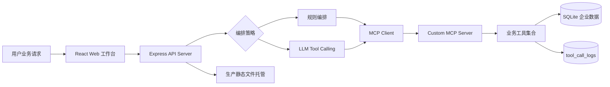
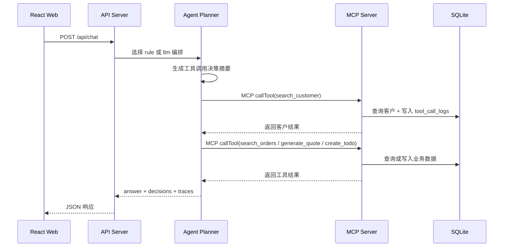

# 架构说明

## 总览



## 模块职责

| 模块 | 职责 |
|---|---|
| `apps/web` | 展示业务请求输入、编排模式、决策摘要、工具调用时间线、历史日志 |
| `apps/api-server` | 提供 HTTP API、选择编排策略、连接 MCP Server、托管生产前端 |
| `apps/mcp-server` | 暴露 MCP 工具，执行权限校验、参数校验、业务查询和日志写入 |
| `packages/shared` | 共享 Zod schema、角色类型、工具调用类型 |
| `data/enterprise-agent.db` | SQLite 业务数据和工具调用日志 |

## Tool Calling 流程



## 权限边界

API Server 会注入当前用户的 `userId` 和 `role`，并覆盖模型生成的同名字段。MCP Server 再根据注入后的权限上下文执行数据访问控制。

这保证了：

- 模型不能伪造角色访问客户数据
- 工具层可以独立复用
- 工具调用日志记录的是实际权限上下文

## 部署形态

生产模式下只有一个对外 HTTP 服务：

```text
http://localhost:4000
```

API Server 负责：

- `/api/chat`
- `/api/logs`
- `/health`
- 前端静态文件
- 通过 stdio 拉起构建后的 MCP Server
